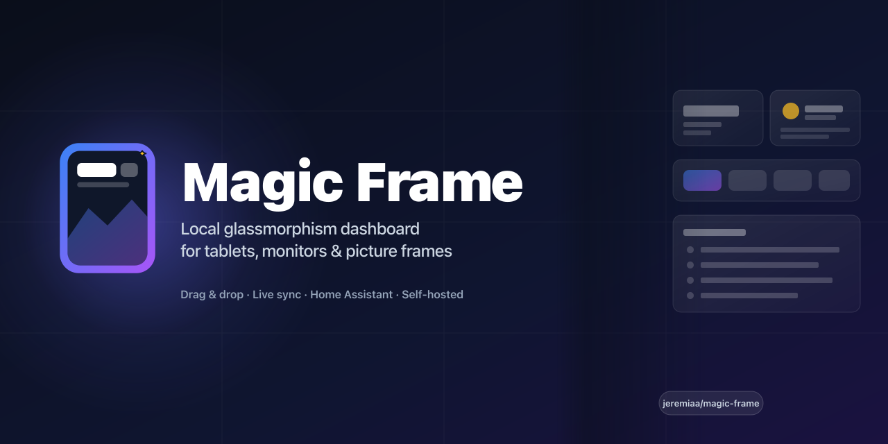
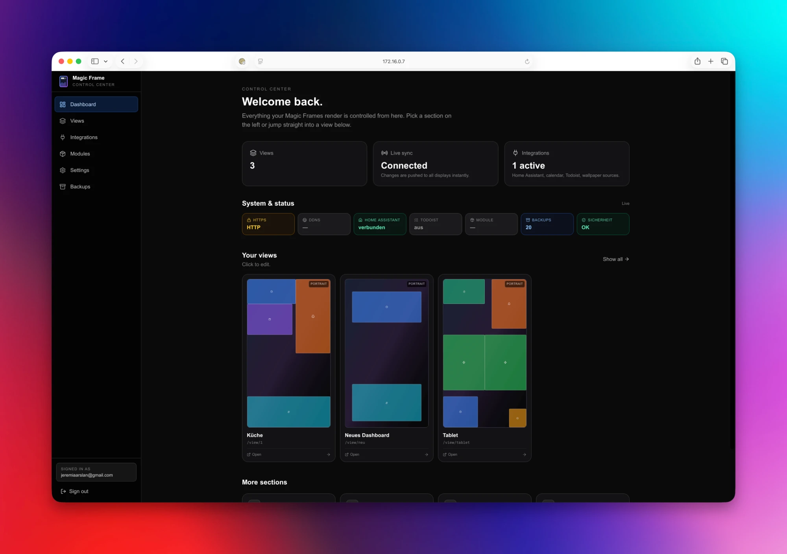
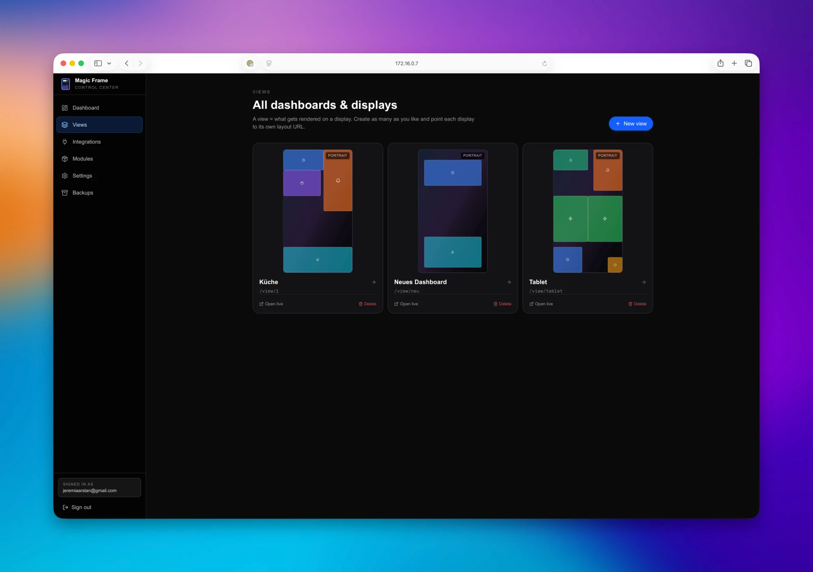
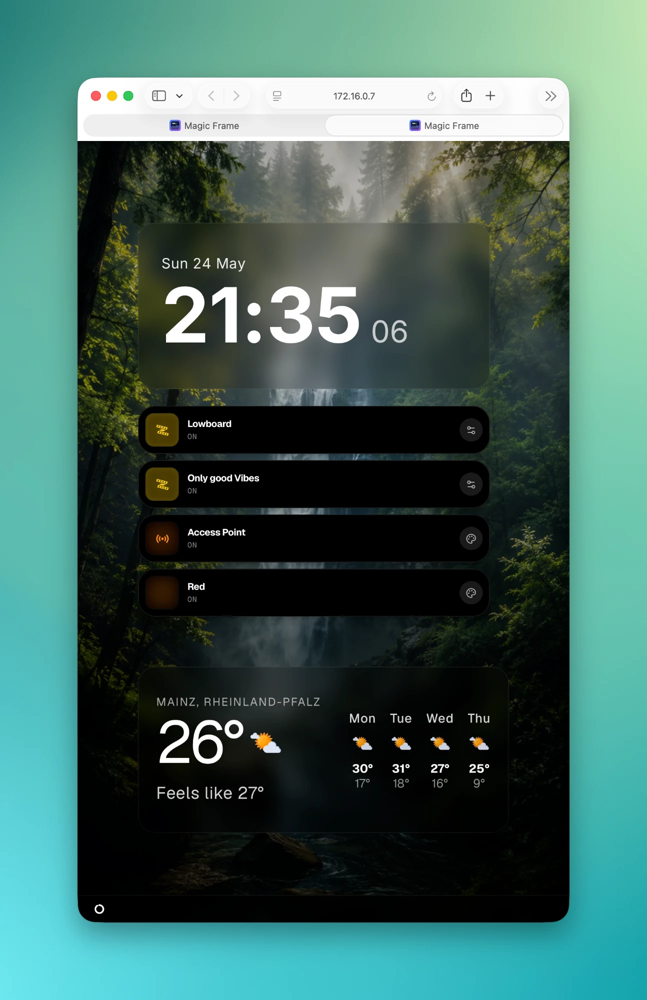
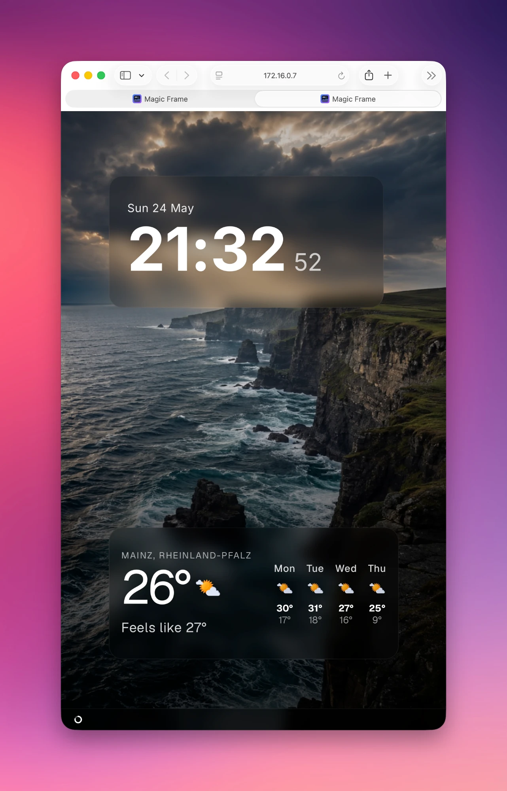
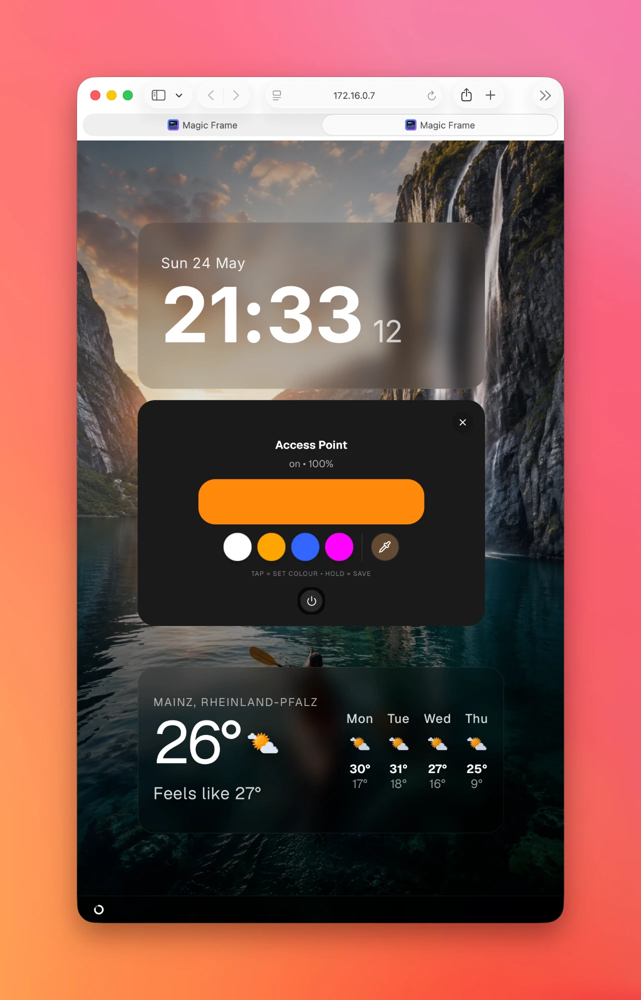
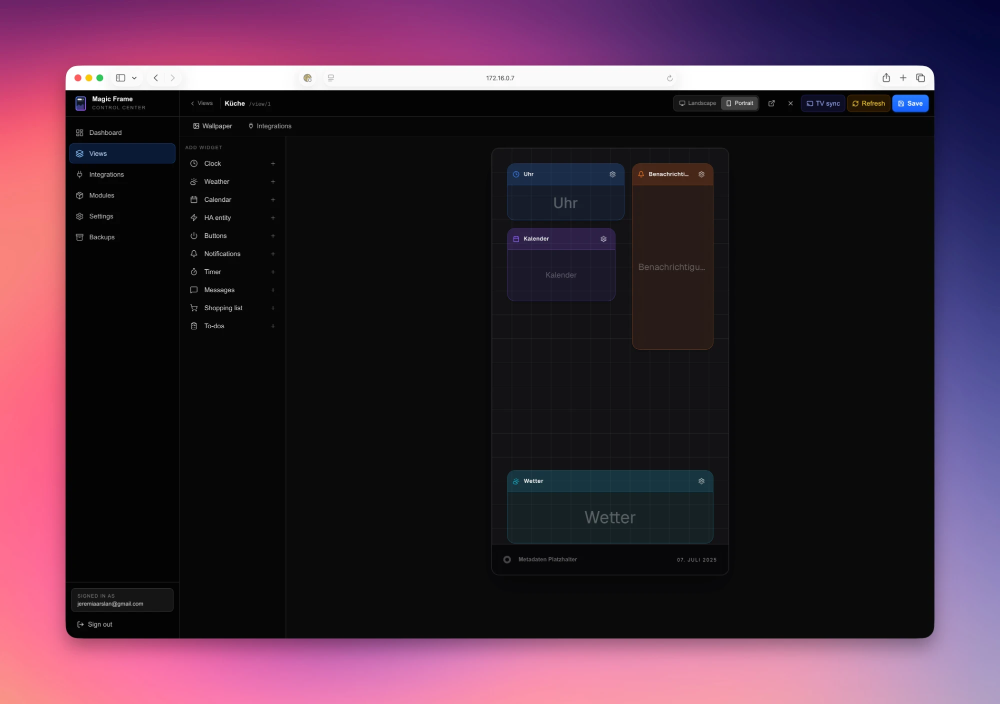
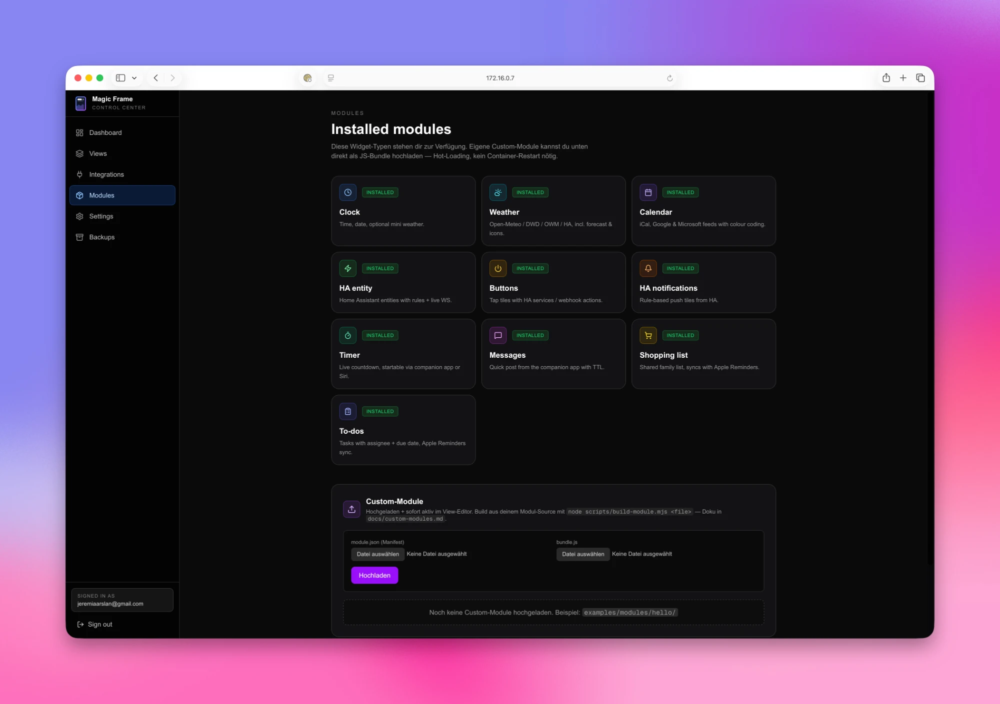

<div align="center">



**English** · [Deutsch](README.de.md) · 🌐 **[magicframe.dev](https://magicframe.dev)**

Runs entirely on your home network — no cloud account, no domain needed.

Drag & drop editor · Real live updates · Smart-home · Calendar · Weather · Picture-frame mode

[](LICENSE.md)
[](https://nextjs.org/)
[](https://www.docker.com/)
[]()
[](https://github.com/sponsors/jeremiaa)

</div>

---

## What is it?

Magic Frame turns any browser-capable screen — tablets, kitchen monitors, old TVs, picture frames — into a self-hosted display for your home:

- **Family board** — shopping list, todos, calendar, weather
- **Smart-home hub** — live Home Assistant entities, scene buttons, camera pop-ups, notification tiles
- **Digital picture frame** — wallpaper rotation from Immich or WebDAV, subtle clock on top
- **Status display / signage** — power usage, timers, quick posts, rotating notices *(non-commercial — see [license](LICENSE.md))*

One **view** per display, each with its own URL, layout and wallpaper. Everything syncs live over WebSocket — change a widget on your laptop and every display updates in under 100 ms, no refresh.

## Where does it run?

Install it once on any box in your home network — that machine becomes "the server", your displays just open its IP in a browser. **No cloud account, no domain, no DDNS required.** Postgres ships inside the Docker stack.

| Hardware | |
|---|---|
| Raspberry Pi 4 / 5, Mini-PC (NUC, Beelink, …) | ✅ |
| Synology / QNAP NAS | ✅ Docker package in the NAS OS |
| Old laptop / desktop / Mac mini | ✅ |
| VPS / cloud server | ✅ optional — only if you want outside access |

> Rule of thumb: as long as you don't actively set up a domain, everything stays local on your LAN.

---

## Quick Start

Two commands on a fresh Linux box. Skip step 1 if you already have Docker:

```bash
# 1. Install Docker (with Compose plugin) — official one-liner
curl -fsSL https://get.docker.com | sh

# 2. Install Magic Frame
curl -fsSL https://raw.githubusercontent.com/jeremiaa/magic-frame/main/deploy/install.sh | bash
```

> macOS / Windows? Install [Docker Desktop](https://www.docker.com/products/docker-desktop/) instead of step 1, then run step 2 in a terminal.
>
> **No `curl`?** Install it (`sudo apt install curl` / `sudo dnf install curl`) — or use git instead: `git clone https://github.com/jeremiaa/magic-frame.git && cd magic-frame && ./deploy/install.sh`

The installer clones the repo, generates secrets, pulls the pre-built multi-arch images (ghcr.io, `amd64` + `arm64` — no 20-minute compile on a Pi) and starts the stack: app + Postgres + Caddy. Then open `http://<your-ip>` → **setup flow** → create the first admin → done. Integrations (Google/Microsoft Calendar, OpenWeatherMap, Todoist, Home Assistant, Immich) are all added later through the UI.

### Updating to a new version

**The same command updates you** — run it from the `magic-frame` folder any time a new version is out. It pulls the latest code, grabs the new images, and restarts. Your data, login, secrets and uploaded modules are **never touched** (none of that lives in git):

```bash
cd magic-frame && ./deploy/install.sh
```

No separate `git pull` needed — the installer does it for you. To build from source instead (forks, local changes): `./deploy/install.sh --build`

---

## Demo

### Editor — drag widgets onto the grid, configure in the inspector

<div align="center">
  
</div>

### Dashboard — all your views and live system status at a glance

<div align="center">
  
</div>

<sub><a href="public/demo/magic-frame-preview.mp4">Watch the full ~1 min walkthrough</a> (create view → drag widgets → configure inspector → save → live-sync to displays).</sub>

---

## In the wild

Real-world setups across different hardware. Same project, different layouts, different rooms.

### Big portrait monitor on the wall

<table>
<tr>
<td width="50%"></td>
<td width="50%"></td>
</tr>
<tr>
<td valign="top"><sub><strong>Info layout:</strong> clock, two upcoming calendar events, three live HA notifications, current temperature and 4-day weather forecast over a rotating Immich wallpaper. Quiet and glanceable for a hallway, office or bedroom wall.</sub></td>
<td valign="top"><sub><strong>Notifications close-up:</strong> rule-based tiles that auto-show when something happens (washing machine done, "feed Milou", dryer done) and auto-hide once acknowledged. Wallpaper keeps running underneath.</sub></td>
</tr>
</table>

### Picture-frame tablet on a side table

<p align="center"></p>

<p align="center"><sub><strong>Scene-button layout:</strong> a small tablet in a real photo-frame mount. Quick-access HA buttons, small clock, current temperature, rotating wallpaper underneath.</sub></p>

<details>
<summary><b>📸 More screenshots — dashboard, views, editor, modules</b></summary>

### Dashboard — entry point with live status
<div align="center">
  
</div>
<sub>3 stat cards (views · live-sync · integrations) + system-status strip (HTTPS, DDNS, HA, Todoist, modules, backups, security) + mini-previews of all views at a glance.</sub>

### Views — all dashboards & displays
<div align="center">
  
</div>
<sub>Each view is its own URL for one display — portrait for the tablet, landscape for the TV. Live previews show the real widget arrangement per view.</sub>

### What it looks like on the display

<table>
<tr>
<td width="33%"></td>
<td width="33%"></td>
<td width="33%"></td>
</tr>
<tr>
<td valign="top"><sub><strong>Smart-home display:</strong> clock, 4 scene/device buttons (HA services), weather with 4-day forecast.</sub></td>
<td valign="top"><sub><strong>Minimal / picture frame:</strong> just clock + weather, the wallpaper rotation is the main element.</sub></td>
<td valign="top"><sub><strong>In action:</strong> tap on a button opens the matching pop-up — here a colour picker for a lamp incl. power toggle.</sub></td>
</tr>
</table>

### View editor — drag &amp; drop
<div align="center">
  
</div>
<sub>24-column grid, widget catalog on the left, inspector on the right. Auto-snapshot before every save, TV-sync to all connected displays.</sub>

### Modules — upload your own widgets
<div align="center">
  
</div>
<sub>13 core widgets installed. Custom modules via JS-bundle upload — hot-loading, no container restart needed.</sub>

</details>

---

## Features

### Widgets (13 core)

| Widget | Description |
|---|---|
| **Clock** | Time + date, optional mini weather, 12/24h |
| **Weather** | Open-Meteo, DWD, OpenWeatherMap, or HA weather entity |
| **Calendar** | iCal + Google + Microsoft 365 · 3-day agenda mode · 12/24h toggle |
| **Home Assistant** | Any HA entity + rule engine (colour/icon per state) |
| **HA Notifications** | Rule-based push tiles, tap-to-toggle, auto-hide when quiet |
| **Camera** | HA camera entities — snapshot refresh, fullscreen view |
| **Sensor** | Multi-sensor value tiles — per-sensor icon/colour, history sparkline |
| **Image** | Photo tile — Immich album or WebDAV slideshow |
| **Buttons** | Tap tiles with HA service calls (incl. service data) / webhooks |
| **Timer** | Live countdown, startable via REST API / iOS Shortcut |
| **Messages** | Quick post (text + image) via REST API with TTL |
| **Shopping** | 3 sources: local, HA (todo.\*) or **Todoist** |
| **Todos** | 3 sources: local, HA (todo.\*) or **Todoist** |

### Editor & live view

- **Drag & drop builder** on a 24-column grid — multiple views (portrait/landscape), one URL per display
- **Stack & overlay widgets** with a drag-sortable layer list (z-order)
- **HA-triggered show/hide** — bind any widget to an entity state: doorbell rings → camera pops up over the photos, auto-hides after n seconds. Home Assistant can also "press" dashboard buttons remotely
- **Light + dark editor theme** · per-view auto-refresh (off / 1–24 h) · auto-snapshots before every save (last 20)
- **Live sync** via WebSocket to every connected display · i18n German + English

### Integrations

- **Home Assistant** — live entity updates over one WebSocket (pushed, not polled)
- **Google Calendar** and **Microsoft 365** via OAuth (multiple accounts) — plus plain iCal feeds
- **Immich** + **WebDAV** as wallpaper sources · **Todoist** · **OpenWeatherMap** (optional)

<details>
<summary><b>📅 Google Calendar on a home network — two ways</b></summary>

- *Simplest read-only path:* Google Calendar's **secret iCal address** (Google Calendar → Settings → *Integrate calendar*) works as a plain iCal feed — no OAuth app, no domain needed. Trade-offs: Google refreshes that export on its own schedule (it can lag a few hours), and the link grants read access to anyone who has it.
- *OAuth on a LAN-only install:* Google refuses local addresses as redirect URIs — but the domain **never has to be reachable from the internet**, it only has to resolve to your box *inside* your network. Set up a DDNS domain + HTTPS under *Settings → Hosting & Network* (DuckDNS/Cloudflare built in, DNS-challenge — no open ports), then open the editor via that https URL when connecting Google.

</details>

<details>
<summary><b>🔐 Hosting & security — all optional, off by default</b></summary>

For purely local LAN use you need none of these. Toggle-able in the UI:

- **Caddy reverse proxy** with automatic HTTPS via Let's Encrypt
- **10 DNS providers** baked in for ACME DNS-01 (no open ports needed)
- **DDNS updater** (Cloudflare, Hetzner, DynDNS-v2 generic)
- **2FA (TOTP)** with authenticator apps + recovery codes
- **In-app brute-force protection** · **scrypt** password hashing · iron-session

</details>

### Custom modules

Upload a JS bundle through the UI — **hot-loaded** on every display, no container restart. Build helper (`node scripts/build-module.mjs`), manifest with field schema, example module in [`examples/modules/hello/`](examples/modules/hello/). See [`docs/custom-modules.md`](docs/custom-modules.md) — community modules & PRs welcome.

<details>
<summary><b>📱 Companion app (iOS) — in development</b></summary>

Native Swift app being built alongside the web editor. **Not yet available — TestFlight beta coming soon.** Planned: lock-screen timer (App Intent), quick posts with TTL, shopping/todos sync with iOS Reminders, push notifications per frame, view switch/refresh from anywhere.

Until then (and afterwards too): all of this already works via the REST API with a shortcut token — perfect for iOS Shortcuts, Tasker, or curl. See [`docs/companion-api.md`](docs/companion-api.md).

</details>

---

## Architecture

One Docker stack with three services, all on the same host:

| Layer | What |
|---|---|
| **Caddy** | Reverse proxy + automatic HTTPS (Let's Encrypt). Custom build with 10 DNS plugins for ACME DNS-01. For purely local use it runs as a plain HTTP proxy without TLS. |
| **Next.js app** | `/editor` is the admin UI. `/view/<id>` is what displays render. `/api/...` is the REST surface for the companion app, shortcuts, and external tools. Socket.IO pushes live updates to every display. |
| **Postgres 16** | Dashboards, layouts, snapshots, users, OAuth tokens, custom modules, app settings. |

**Data flow on save:** browser edits a widget → Next.js API → snapshot to Postgres → Socket.IO event → every display re-renders in under 100 ms. **Persistent volumes** (Postgres data, settings, wallpaper cache, Caddyfile, certs) survive every update.

---

## Maintenance

```bash
cd magic-frame && ./deploy/install.sh                # update — data, login and modules survive
docker compose logs -f app                           # logs (app / caddy)
docker compose exec db pg_dump -U postgres magicdashboard | gzip > backup-$(date +%F).sql.gz   # DB backup
```

<details>
<summary><b>Update fails with "divergent branches" / "would clobber existing tag" (early v1.0.x clones)</b></summary>

If you cloned during launch week (before v1.0.2), upstream history was rewritten a few times. One-time recovery — your `.env`, database and modules are untouched (none of that lives in git):

```bash
cd magic-frame
git fetch --force --tags origin
git reset --hard origin/main
./deploy/install.sh
```

</details>

---

## Troubleshooting

<details>
<summary><b>Browser refuses to load <code>http://&lt;server-ip&gt;</code> / says HTTPS failed</b></summary>

Brave, Chrome and Edge auto-upgrade `http://` to `https://`. On a fresh local install there's no cert yet, so the upgrade fails before the request reaches Magic Frame.

- **Quickest workaround:** type the full path — `http://<server-ip>/login` (the auto-upgrade often only fires on bare host URLs)
- **Brave:** `brave://settings/security` → *"Always use secure connections"* → off (or per-site exception) · **Chrome/Edge:** same setting under `chrome://settings/security`
- **Long-term fix:** set up a domain → Caddy gets a real Let's-Encrypt cert automatically (*Settings → Hosting & Network*)

</details>

<details>
<summary><b><code>Bind for 0.0.0.0:80 failed: port is already allocated</code> during install</b></summary>

Something else on the host is on port 80. Check `ss -tlnp | grep :80` and `docker ps --filter "publish=80"` — common culprits are distro `nginx`/`apache2` (`systemctl stop nginx && systemctl disable nginx`) or another container. After fixing: `docker compose down && docker compose up -d`.

</details>

<details>
<summary><b>Page still shows old behaviour after an update</b></summary>

Next.js and your browser both cache aggressively. Hard-refresh (`Cmd+Shift+R` / `Ctrl+Shift+R`) or use an incognito window after `docker compose up -d --build`.

</details>

---

## Documentation

| | |
|---|---|
| [`ROADMAP.md`](ROADMAP.md) | What's coming next + how releases work |
| [`LICENSE.md`](LICENSE.md) | Polyform Noncommercial 1.0.0 |
| [`.env.example`](.env.example) | All environment variables documented |
| [`docs/custom-modules.md`](docs/custom-modules.md) | Build + upload your own widget modules |
| [`docs/module-development.md`](docs/module-development.md) | Core-widget development (source-tree patch) |
| [`docs/companion-api.md`](docs/companion-api.md) | REST API endpoints (companion app / your own scripts) |
| [`kubernetes/`](kubernetes/) | Community Kubernetes manifests (thanks @RudiKlein) |

---

## Tech stack

Next.js 16 · React 19 · Postgres 16 + Prisma 7 · Caddy 2 (xcaddy custom build) ·
Tailwind CSS 4 · Socket.IO · react-grid-layout · iron-session · otplib · esbuild

---

## Contributing

Issues with a clear reproduction are especially welcome — they directly drive releases (most of v1.1 came straight from community requests). PRs are happily reviewed; for larger changes please open an issue first so we can sort out what fits.

---

## ❤️ Support

Magic Frame is free for home use and built in my spare time. If it hangs on your wall and you want to say thanks:

[](https://github.com/sponsors/jeremiaa)
[](https://buymeacoffee.com/jeremiaa)

---

## License

**[Polyform Noncommercial 1.0.0](LICENSE.md)** — open-source-style,
allows free use, modification, distribution, and contribution.
Commercial use (selling, SaaS offering, embedding in your own products)
is not permitted without a separate license.

For commercial inquiries: **magicframeapp@gmail.com**

<sub>Vibe-coded with Claude.</sub>
