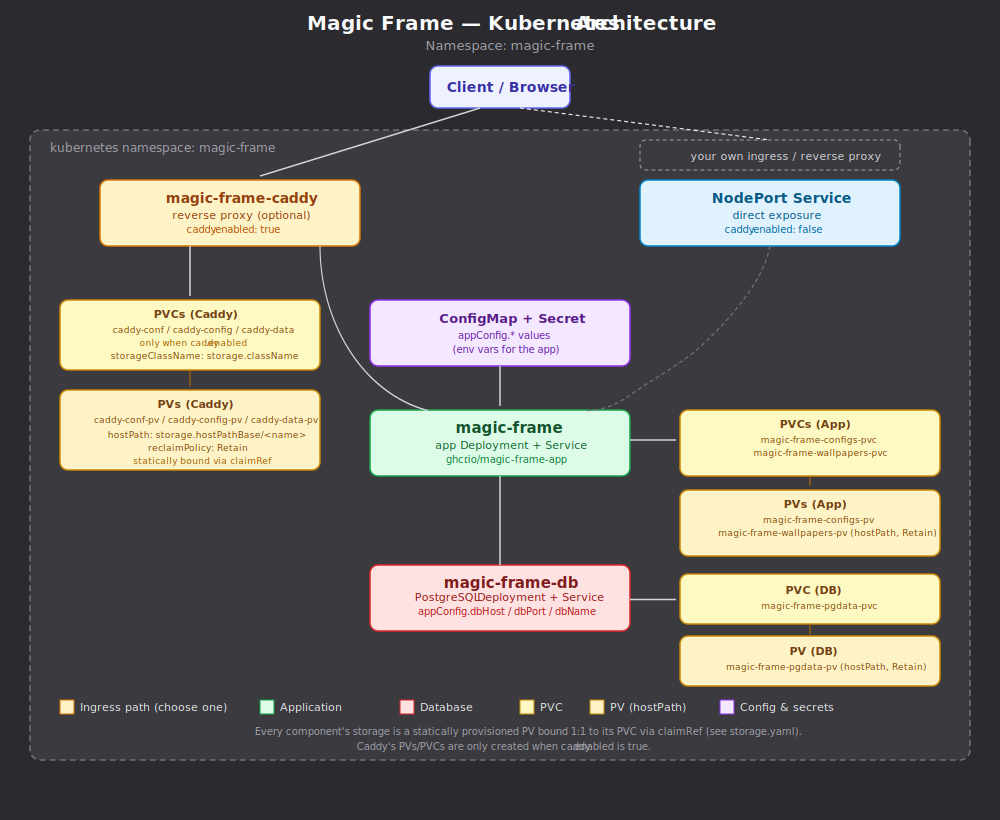

# Magic Frame – Kubernetes Deployment Guide

This guide covers deploying Magic Frame on Kubernetes. It assumes you already have a working Kubernetes cluster (this guide is written with k3s in mind, but the manifests are vanilla Kubernetes), basic familiarity with `kubectl`, and - for the Helm-based options - basic familiarity with Helm.

## 1. Overview

Magic Frame ships three interchangeable ways to deploy it on Kubernetes. They all produce the same set of resources; pick whichever fits your workflow:

| Option            | Best for                                                                                                                                 | Requires Helm?           |
|-------------------|------------------------------------------------------------------------------------------------------------------------------------------|--------------------------|
| **Helm install**  | Fastest path; Helm manages the release for you                                                                                           | Yes                      |
| **Helm template** | You want the flexibility of Helm's templating, but prefer to apply manifests yourself (review diffs, use your own GitOps pipeline, etc.) | Yes, only at render time |
| **Raw manifests** | You don't want Helm at all                                                                                                               | No                       |

The raw manifests are not hand-maintained separately – they are the committed output of `helm template`, split into two sets:

- **`authoring/with-caddy/`** - includes the Caddy reverse proxy as the ingress point.
- **`authoring/without-caddy/`** - omits Caddy; use this if you already run your own ingress controller or reverse proxy.

Because they are generated output, if you need to change something in them beyond the values described in this guide, treat that as a signal you should switch to Helm instead.



### Components

Every deployment method creates the same resources:

- **`magic-frame-app`** - the application Deployment plus Service
- **`magic-frame-db`** - a PostgreSQL Deployment + Service
- **`magic-frame-caddy`** - the Caddy reverse proxy Deployment plus Service (only when Caddy is enabled)
- A **ConfigMap** and **Secret** holding the app's environment configuration
- **PersistentVolume(s)** and **PersistentVolumeClaim(s)** for app and database storage
- A **NodePort Service** exposing the app directly, used when Caddy is disabled (or as a fallback path when it's enabled)

## 2. Prerequisites

Before deploying, make sure you have:

1. **A Kubernetes cluster** with at least one node with local storage available (see [Storage](#6-storage) for why this matters).
2. **The application images are built and available to the cluster:**
   - App image: `ghcr.io/magic-frame-app:latest`
   - Caddy image (only if using Caddy): `ghcr.io/magic-frame-caddy:latest`
   - Both are pulled with `imagePullPolicy: Always`, so your cluster nodes need network access to `ghcr.io`, or you need to have pushed the images to a registry your cluster can reach.
3. **A namespace decision.** The default namespace across all three options is `magic-frame`. It's created for you by the manifests/chart - you don't need to `kubectl create namespace` yourself.
4. **(Helm only)** Helm 3.x installed locally.

### 2.1 Create a Namespace
First, create a namespace for Magic Frame. This can be any name, but must be consistent throughout the manifests. For the sake of this documentation we will use, surprisingly, "magic-frame". Avoid using the default namespace.

```bash
kubectl create namespace magic-frame
```
### 2.2 Create a "Session Secret" that will allow safe communication.
There are a number of ways to create and implement a secret (as in Step 2), in this case we will use a manual option as an example. There are many ways to create a 32-character hex value. If you prefer to create it any other way, that's fine.

You can run the following command on a Linux system or on WSL on Windows.
If you want to go really hard-core, type 32 random hex numbers.

```
$ head -c 32 /dev/urandom | od -An -tx1 -v | tr -d ' \n'
```
Copy the secret and save it for now.

## 3. Deployment options

### 3.1 Option A – Helm install (recommended)

This is the simplest path – Helm manages the release for you.

Download the chart (the complete helm directory)
```bash
cd helm (or the directory containing the files you just downloaded)
```
```bash
helm install magic-frame . -f values.yaml
```

To upgrade later, edit `values.yaml` and run:

```bash
helm upgrade magic-frame . -f values.yaml
```

To remove the deployment:

```bash
cd helm #(or the directory containing the files you just downloaded)
```
```bash
helm uninstall magic-frame
```
Goto [Section 4](#4-choosing-with-or-without-caddy) for more info on Helm with or without Caddy.

### 3.2 Option B – Helm template + kubectl apply

Use this if you want to inspect or version-control the exact manifests being applied or feed them into your own deployment pipeline.

```bash
cd helm #(or the directory containing the files you just downloaded)
```
```bash
helm template magic-frame . -f values.yaml > rendered.yaml #(1 complete manifest)
kubectl apply -f rendered.yaml
```
or

```bash
helm template magic-frame . -f values.yaml --output-dir rendered #(separate manifests)
kubectl apply -f rendered/<manifest-name>.yaml #(for each manifest)
```

You're responsible for re-running `helm template` and re-applying (or diffing) whenever `values.yaml` changes.  

NOTE:  
*_Look for the lines in the values.yaml with the '### CHANGE THIS!' comment._*  
*_See section 5 for more on configuration reference._*

### 3.3 Option C – Raw manifests (no Helm)

Pick the set matching whether you want Caddy as your ingress (/with-caddy or /without-caddy):

**With Caddy:**
Download the authoring/with-caddy/ folder.

```bash
kubectl apply -f authoring/with-caddy/
```

**Without Caddy** (bring your own ingress/reverse proxy):
Download the authoring/without-caddy/ folder.
```bash
kubectl apply -f authoring/without-caddy/
```

Because these are pre-rendered, any configuration change (passwords, secrets, hostnames, etc.) means editing the YAML files directly – there's no `values.yaml` to adjust. If you find yourself editing these regularly, switch to one of the Helm-based options instead.

*_!! Look for the lines in the configmap.yaml and the secret.yaml with the string '\_HERE'. They are at the end of the file._*

## 4. Choosing with or without Caddy

This is controlled by a single toggle: `caddy.enabled` in `values.yaml` (`true`/`false`), or by which `authoring/` folder you apply.

- **`caddy.enabled: true`** - Caddy is deployed and acts as the reverse proxy / ingress point for the app. Use this if you don't already have a reverse proxy in front of your cluster.
- **`caddy.enabled: false`** - Caddy is skipped entirely. The app is instead exposed via a NodePort Service, so you can point your own ingress controller or reverse proxy at `<node-ip>:<nodePorts.httpPort>`.

*_Look for the lines in the values.yaml with the '### CHANGE THIS!' comment._* 

## 5. Configuration reference (`values.yaml`)

This table applies to both Helm options (Option A and B). For raw manifests, the equivalent value is set directly wherever it appears in the manifest files.

| Key                                                         | Purpose                                                | Notes                                                                                                                                                            |
|-------------------------------------------------------------|--------------------------------------------------------|------------------------------------------------------------------------------------------------------------------------------------------------------------------|
| `caddy.enabled`                                             | Toggle Caddy on/off                                    | See [section 4](#4-choosing-with-or-without-caddy)                                                                                                               |
| `namespace.namespace`                                       | Target namespace for all resources                     | Default: `magic-frame`                                                                                                                                           |
| `image.repository`                                          | App container image                                    | Default: `ghcr.io/magic-frame-app`                                                                                                                               |
| `image.tag`                                                 | App image tag                                          | Default: `latest`                                                                                                                                                |
| `image.pullPolicy`                                          | Image pull policy                                      | Should be `Always`                                                                                                                                               |
| `nodePorts.httpPort`                                        | External NodePort for HTTP                             | Default `30080`. **Must fall within your cluster's NodePort range** - k3s defaults to `30000–32767`. Change if it conflicts with something else on your cluster. |
| `nodePorts.httpsPort`                                       | External NodePort for HTTPS                            | Default `30443`                                                                                                                                                  |
| `nodePorts.caddyPort`                                       | External NodePort for the Caddy admin API              | Default `32019`                                                                                                                                                  |
| `appConfig.appBaseUrl`                                      | Public base URL the app is served from                 | e.g. `https://frame.example.com`                                                                                                                                 |
| `appConfig.caddyAdminUrl`                                   | Internal URL the app uses to talk to Caddy's admin API | Only relevant when Caddy is enabled                                                                                                                              |
| `appConfig.cookieSecure`                                    | Whether session cookies require HTTPS                  | Set to `"true"` in production behind TLS                                                                                                                         |
| `appConfig.googleClientId` / `appConfig.googleClientSecret` | Google OAuth credentials                               | Leave blank to disable Google login                                                                                                                              |
| `appConfig.msClientId` / `appConfig.msClientSecret`         | Microsoft OAuth credentials                            | Leave blank to disable Microsoft login                                                                                                                           |
| `appConfig.nodeEnv`                                         | Node environment                                       | Default `production` - leave as-is unless debugging                                                                                                              |
| `appConfig.dbHost` / `dbPort` / `dbName` / `dbUser`         | Database connection details                            | Must match the `magic-frame-db` Service unless you're pointing at an external database                                                                           |
| `appConfig.dbPassword`                                      | Database password                                      | **Change from the placeholder before deploying**                                                                                                                 |
| `appConfig.sessionSecret`                                   | Secret used to sign session cookies                    | **Generate a unique, random value** - don't reuse the sample value across environments                                                                           |
| `appConfig.openWeatherMapApiKey`                            | OpenWeatherMap API key                                 | Leave blank to disable weather features                                                                                                                          |
| `storage.className`                                         | StorageClass name used by the static PVs               | See [Storage](#6-storage) below                                                                                                                                  |
| `storage.capacity`                                          | Size of the provisioned volumes                        | Default `100Mi`                                                                                                                                                  |
| `storage.hostPathBase`                                      | Base host path used for `hostPath` volumes             | Default `/var/lib/rancher/k3s/storage` - a k3s-specific path                                                                                                     |

At minimum, before your first deployment, set:
- `appConfig.dbPassword`
- `appConfig.sessionSecret`
- `caddy.enabled` (based on whether you have your own ingress)

## 6. Storage

By default, storage is provisioned **statically** using `hostPath` volumes: the chart creates a `PersistentVolume` per component, bound via `claimRef` directly to its matching `PersistentVolumeClaim`, backed by a directory on the node's filesystem (`storage.hostPathBase`).

**This only works reliably on a single-node cluster**, or if you can guarantee the app and database pods will always be scheduled on the same node where the data lives - `hostPath` storage isn't shared across nodes. On a multi-node cluster, a pod rescheduled to a different node won't see its data.

### Using dynamic provisioning instead

If your cluster has a dynamic StorageClass available (for example, k3s's built-in `local-path` provisioner, or a network storage provisioner), you can skip static PVs entirely:

1. Remove (or don't apply) the `PersistentVolume` resources.
2. Keep the `PersistentVolumeClaim` resources, but set `storage.className` to the name of your dynamic StorageClass (e.g. `local-path`).
3. Apply as normal – the provisioner will create the underlying volumes automatically to match each PVC.

This is generally the better option unless you specifically need the data pinned to a known path on disk.

## 7. Networking

- **With Caddy enabled:** Caddy is your entry point. Point your DNS/router at the node's IP on the NodePort defined by `nodePorts.httpPort` / `nodePorts.httpsPort`, and Caddy handles routing to the app internally.
- **With Caddy disabled:** the app itself is exposed via the NodePort Service on `nodePorts.httpPort`. Point your own ingress controller or reverse proxy at `<node-ip>:<nodePorts.httpPort>`.

## 8. Upgrading

- **Helm install:** edit `values.yaml`, then `helm upgrade magic-frame . -f values.yaml`.
- **Helm template:** re-run `helm template` and re-apply/diff the output.
- **Raw manifests:** edit the relevant file(s) directly and `kubectl apply -f` again.

## 9. Troubleshooting

- **App can't reach the database:** check `appConfig.dbHost`/`dbPort`/`dbName`/`dbUser`/`dbPassword` match what's actually running, and confirm the `magic-frame-db` Service and pod are healthy (`kubectl get pods,svc -n magic-frame`).
- **502/Bad Gateway from Caddy:** confirm the app Service name and port match what's configured in Caddy's config, and that DNS resolution works inside the Caddy pod (`kubectl exec` into it and `wget http://magic-frame:<port>`).
- **NodePort not reachable:** confirm the chosen ports fall within your cluster's allowed NodePort range (k3s default: `30000–32767`) and aren't yet in use by another service.
- **Pod stuck in `ImagePullBackOff`:** confirm the images are reachable from your nodes and that you're using the fully qualified `ghcr.io/magic-frame-app:latest` / `ghcr.io/magic-frame-caddy:latest` image names.
- **PVC stuck in `Pending`:** confirm `storage.className` matches an existing StorageClass on your cluster, and (for static provisioning) that `storage.hostPathBase` exists and is writable on the target node.
